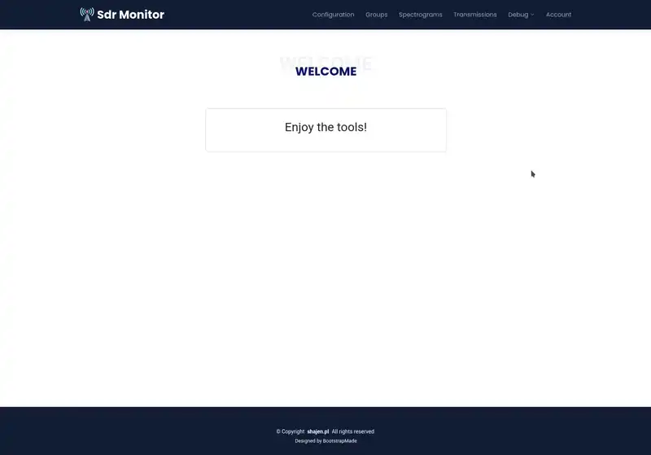

# SDR



# Introduction

This project is **all in one** type, it combines two subprojects into one to allow easy launch them.

## Scanner

[https://github.com/shajen/rtl-sdr-scanner-cpp](https://github.com/shajen/rtl-sdr-scanner-cpp)

This project contains sdr scanner written in `c++` to **scan and record multiple interesting frequencies bandwidth in the same time** (eg. `108 MHz`, `144 MHz`, `440 Mhz`,  etc). This is possible by switching quickly between frequencies bandwidth.

Scanner also allows you to record multiple transmissions simultaneously (if they are transmitted on the same band). For example, if one transmission is on `145.200` MHz and the other is on `145.600 MHz`, the scanner will record and save both!

Scanner use [Soapy SDR](https://github.com/pothosware/SoapySDR) and [GNU Radio](https://github.com/gnuradio/gnuradio) to get data so it support all devices that are supported by `Soapy SDR`. Full list of supported devices/drivers [here](https://github.com/pothosware/SoapyOsmo/wiki).

## Web panel

[https://github.com/shajen/sdr-monitor](https://github.com/shajen/sdr-monitor)

Very powerful **web panel** to explore transmissions, spectrograms and configure sdr device.

# Info

## YouTube

Video [here](https://www.youtube.com/watch?v=YzQ2N0VkKvE), thanks to **Tech Minds**!

## Community

Join our [discord server](https://discord.gg/f2cqeMh6Dh) to get help, share ideas, or contribute.

## Wiki

Many useful instructions and information are on the [wiki](https://github.com/shajen/sdr-hub/wiki).

# Screens

## Data

| Spectrogram | Transmission |
| - | - |
|  |  |
|  |  |

## Configuration

| Scanner | Groups |
| - | - |
|  |  |

# Quickstart

## Install docker

If you do not have `docker` installed, follow the instructions [here](https://docs.docker.com/desktop/) to install `docker`.

## Run

```
docker run --rm -p 8000:80 -v ./data:/app/data -v ./log:/var/log/sdr --device /dev/bus/usb:/dev/bus/usb shajen/sdr-hub
```

All collected data and config will be permanently saved in the local `data` directory.

All logs will be permanently saved in the local `log` directory.

## Web panel

Default web panel address is [http://127.0.0.1:8000/](http://127.0.0.1:8000/), default login: `admin`, password: `password`.

## Configuration

Customize and save settings to `.env` file:

```
TZ=Europe/Warsaw                                     # enter your time zone
SPECTROGRAMS_TOTAL_SIZE_GB=20                        # keep only the last n GB of spectrograms, 0 for unlimited
TRANSMISSIONS_TOTAL_SIZE_GB=20                       # keep only the last n GB of transmissions, 0 for unlimited
SECRET_KEY=0123456789012345678901234567890123456789  # enter your randomly selected key
```

Then run by:
```
docker run --rm --env-file .env -p 8000:80 -v ./data:/app/data -v ./log:/var/log/sdr --device /dev/bus/usb:/dev/bus/usb shajen/sdr-hub
```

# Advanced

## Update

To update to the latest version just pull docker image `docker pull shajen/sdr-hub` and run again.

## Build from sources

Clone repository and run:

```
export SDR_MONITOR_VERSION=latest # enter the selected version
export SDR_SCANNER_VERSION=latest # enter the selected version

docker build -t shajen/sdr-hub --build-arg SDR_MONITOR_VERSION --build-arg SDR_SCANNER_VERSION .
```
## Debug

All logs are stored in the `/var/log/sdr/` directory in the docker container.

You can [download](http://127.0.0.1:8000/sdr/logs/) the archive with all `logs` in the `Debug` tab.

Please attach the `logs` when reporting a bug. **Issues without logs will be closed quickly!**

# Disclaimer

This software may receive and record radio signals. Use it legally — the authors take no responsibility for misuse or unlawful recording.

# Contributing

In general don't be afraid to send pull request. Use the "fork-and-pull" Git workflow.

1. **Fork** the repo
2. **Clone** the project to your own machine
3. **Commit** changes to your own branch
4. **Push** your work back up to your fork
5. Submit a **Pull request** so that we can review your changes

NOTE: Be sure to merge the **latest** from **upstream** before making a pull request!

# Donations

If you enjoy this project and want to thanks, please use follow link:

- [PayPal](https://www.paypal.com/donate/?hosted_button_id=6JQ963AU688QN)

- [Revolut](https://revolut.me/borysm2b)

- BTC address: 18UDYg9mu26K2E3U479eMvMZXPDpswR7Jn

# License

[](https://www.gnu.org/licenses/gpl.html)

- *[GPLv3 license](https://www.gnu.org/licenses/gpl.html)*
